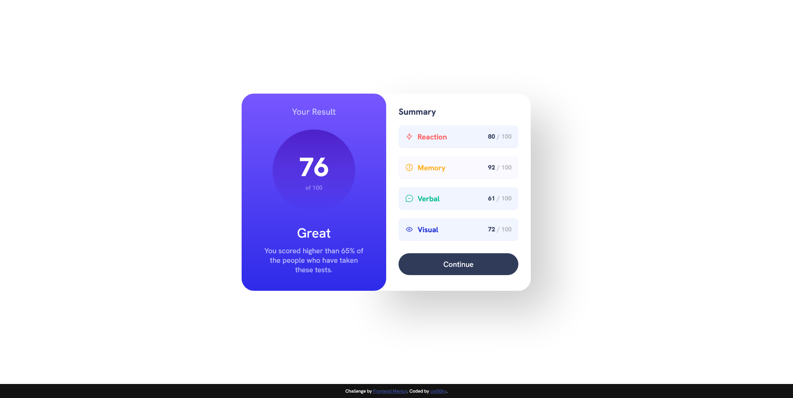

# Frontend Mentor - Results summary component solution

This is a solution to the [Results summary component challenge on Frontend Mentor](https://www.frontendmentor.io/challenges/results-summary-component-CE_K6s0maV). Frontend Mentor challenges help you improve your coding skills by building realistic projects. 

## Table of contents

- [Overview](#overview)
  - [Screenshot](#screenshot)
  - [Links](#links)
- [My process](#my-process)
  - [Built with](#built-with)
- [Author](#author)

## Overview

### Screenshot

### Links

- Solution URL: [URL](https://www.frontendmentor.io/solutions/first-time-using-css-variables-resultsummarycomponentmain-bp-i1oR2af)
- Live Site URL: [Github pages](https://unl00ky.github.io/summary-challenge/)

## My process

### Built with

- Semantic HTML5 markup
- CSS custom properties
- Flexbox
- Mobile-first workflow

## Author

- Github - [unl00ky](https://github.com/unl00ky)
- Frontend Mentor - [@unl00ky](https://www.frontendmentor.io/profile/unl00ky)